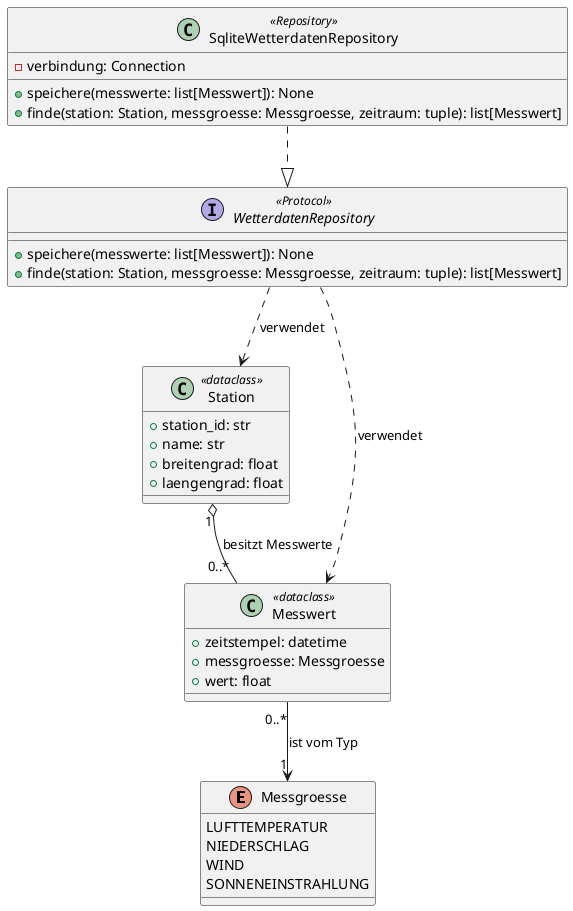

# PlantUML-Notation für Klassensichten

Detaillierte Notationsregeln und vollständiges Beispiel für die Klassensicht, reines UML ohne C4-Includes.

## Legende / Elemente

| Element | PlantUML-Syntax | Verwendung |
|---|---|---|
| Klasse | `class "<Name>" as <Alias> { ... }` | Fachliche Entität oder technischer Baustein (z. B. Repository) innerhalb der Komponente |
| Schnittstelle | `interface "<Name>" as <Alias>` | Von einer/mehreren Klassen implementierter Vertrag (z. B. Repository-Interface) |
| Aufzählungstyp | `enum "<Name>" as <Alias> { WERT1 WERT2 }` | Feste Menge von Werten (z. B. Messgröße) |
| Attribut | `<Sichtbarkeit><name>: <Typ>` im Klassenkörper | Nur architektur-relevante Attribute, mit Typ |
| Methode | `<Sichtbarkeit><name>(<param>: <Typ>): <Rückgabetyp>` im Klassenkörper | Nur öffentliche, architektur-relevante Methoden |
| Sichtbarkeit | `+` öffentlich, `-` privat/geschützt | Python-Konvention: kein führender Unterstrich = `+`, `_`/`__`-Präfix = `-` |
| Vererbung (Generalisierung) | `Sub --|> Super` | Unterklasse erbt von Oberklasse/abstrakter Basisklasse |
| Realisierung | `Klasse ..|> Interface` | Klasse implementiert eine Schnittstelle |
| Assoziation mit Multiplizität | `A "1" --> "0..*" B : <Rolle/Beschriftung>` | Referenzbeziehung zwischen zwei Klassen, eine Richtung pro Pfeil |
| Aggregation | `A o-- B` | „Hat-ein“, Teil kann unabhängig vom Ganzen existieren |
| Komposition | `A *-- B` | „Besteht-aus“, Teil existiert nicht ohne das Ganze (Lebenszyklus gekoppelt) |
| Abhängigkeit/Nutzung | `A ..> B : <benutzt>` | Lose Kopplung, z. B. Methodenaufruf ohne dauerhafte Referenz |
| Stereotyp (verpflichtend bei zutreffendem Python-Konstrukt) | `<<dataclass>>`, `<<Protocol>>`, `<<Repository>>` | Kennzeichnung Python-spezifischer Bausteine: reine Datenklasse, strukturelle Schnittstelle (`Protocol`), Repository-Pattern für Datenbankzugriff |

## Regeln

1. Jedes Diagramm beginnt mit `@startuml <Diagrammname>` und endet mit `@enduml`.
2. Genau **eine** Komponente/Teilkomponente aus der Komponentensicht wird je Diagramm verfeinert; deren Name steht im Diagrammtitel bzw. als Kommentar.
3. Nur architektur-relevante Attribute/Methoden zeigen – keine vollständige Implementierung, keine privaten Hilfsmethoden ohne Architekturbedeutung.
4. Beziehungstyp bewusst wählen: Vererbung nur bei echter Ist-Ein-Beziehung, Komposition nur bei gekoppeltem Lebenszyklus, sonst Aggregation oder einfache Assoziation.
5. Jede Assoziation trägt eine Multiplizität auf beiden Seiten und eine Beschriftung, die die Rolle/Bedeutung der Beziehung beschreibt.
6. Externe Beziehungen der verfeinerten Komponente (zu anderen Komponenten/Nachbarsystemen aus der Komponentensicht) werden nicht dargestellt – die Klassensicht zeigt nur das **Innenleben** der Komponente. Falls eine Klasse von außen genutzt wird, genügt ein kurzer Hinweis in der Tabelle in `klassensicht.md`.
7. Keine Datenbank-spezifischen Implementierungsdetails (z. B. SQL-Spaltentypen) – stattdessen fachliche Typen (`str`, `float`, `datetime`, eigene Klassen/Enums).
8. Stereotypen (`<<dataclass>>`, `<<Protocol>>`, `<<Repository>>`) sind **verpflichtend** anzugeben, sobald eine Klasse dem jeweiligen Python-Konstrukt entspricht – nicht optional. Fehlt ein zutreffender Stereotyp, ist das im Review als Notationsfehler zu markieren.
9. Keine Annahmen über nicht dokumentierte Klassen treffen – bei Unklarheit in Epics/User Stories/FRs bzw. Techstack nachschlagen oder beim Erstellen nachfragen.

## Vollständiges Beispiel (Projekt MyWeatherData)

Verfeinerung der Komponente `Datenhaltung (SQLite)` aus der Komponentensicht (Ebene 1), basierend auf [FR-025](../../../../req/functional-requirement/FR-025-speicherung-wetterdaten-nach-abgeschlossenem-import.md) bis [FR-027](../../../../req/functional-requirement/FR-027-dauerhafte-verfuegbarkeit-nach-app-neustart.md) und [techstack-uebersicht.md](../../../../doc/techstack/techstack-uebersicht.md) (SQLite, `sqlite3`/SQLAlchemy).

## Typische Fehler beim Review

| Fehler | Beispiel | Korrektur |
|---|---|---|
| Klasse ohne Zuordnung zur Komponentensicht | `Messwert` taucht in der Klassensicht auf, aber keine Komponente in der Komponentensicht verwaltet Messwerte | Fehlende Komponente in der Komponentensicht ergänzen oder Klasse der passenden Komponente zuordnen |
| Falscher Beziehungstyp | `Station *-- Messwert` (Komposition), obwohl Messwerte unabhängig von der Station in der DB fortbestehen können | Zu `Station o-- Messwert` (Aggregation) ändern |
| Fehlende Multiplizität | `A --> B` ohne `"1"`/`"0..*"` | Multiplizität auf beiden Seiten ergänzen |
| Vollständige Implementierung statt Architektur-Sicht | Klasse mit 20 privaten Hilfsmethoden und allen internen Feldern | Auf öffentliche, architektur-relevante Attribute/Methoden reduzieren |
| Externe Komponentenbeziehung in der Klassensicht dargestellt | `UI --> SqliteRepository` als Klassenbeziehung eingezeichnet | Entfernen; externe Beziehungen gehören in die Komponentensicht, nicht in die Klassensicht |
| Vererbung statt Realisierung verwendet | `SqliteRepository --|> IRepository` für eine Schnittstellenimplementierung | Zu `SqliteRepository ..|> IRepository` (Realisierung) ändern |
| Fehlender Pflicht-Stereotyp | Klasse `Station` ist als Python `@dataclass` implementiert, aber ohne `<<dataclass>>` dargestellt | Stereotyp `<<dataclass>>` ergänzen |
| C4-Includes verwendet | `!include C4_Component.puml` | Entfernen, reines UML (`class`/`interface`/`enum`) verwenden |
