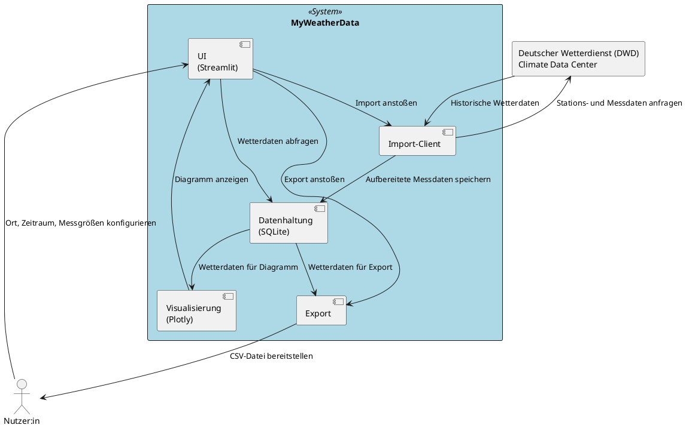
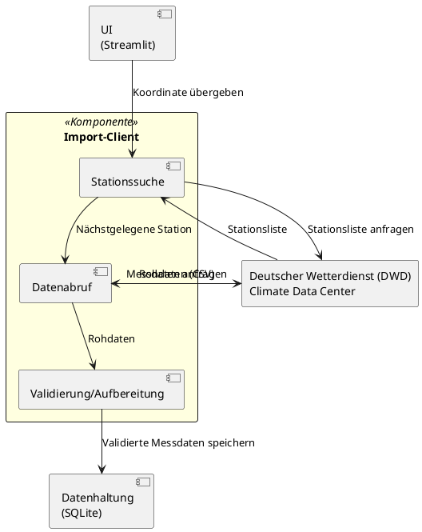

# PlantUML-Notation für Komponentensichten

Detaillierte Notationsregeln und vollständige Beispiele für die Komponentensicht (Ebene 1 + Ebene 2), reines UML ohne C4-Includes.

## Legende / Elemente

| Element | PlantUML-Syntax | Verwendung |
|---|---|---|
| Komponente/Teilkomponente | `component "<Name>" as <Alias>` | Baustein innerhalb des Systems bzw. innerhalb einer vertieften Komponente |
| Schnittstelle (optional, wo aussagekräftig) | `interface "<Name>" as <Alias>` + `<Komponente> - <Alias>` | Explizit benannte Schnittstelle einer Komponente |
| Rahmen des Systems (Ebene 1) | `rectangle "<System>" as System <<System>> { ... }` | Grenze des betrachteten Systems, enthält alle Komponenten |
| Rahmen der vertieften Komponente (Ebene 2) | `rectangle "<Komponente>" as <Alias> <<Komponente>> { ... }` | Grenze der vertieften Komponente, enthält deren Teilkomponenten |
| Externer Akteur/Nachbarsystem | wie in der Kontextsicht: `actor "<Name>"` bzw. `rectangle "<Name>"`/`component "<Name>"` | Außerhalb des Rahmens, identischer Alias wie in der Kontextsicht |
| Beziehung/Datenfluss | `A --> B : <Beschriftung>` | Eine Richtung pro Pfeil; Rückantwort als eigener Pfeil |
| Hervorhebung | `skinparam rectangle<<System>> { BackgroundColor LightBlue }` | Optisches Absetzen von System bzw. vertiefter Komponente |

## Regeln

1. Jedes Diagramm beginnt mit `@startuml <Diagrammname>` und endet mit `@enduml`.
2. **Ebene 1**: Genau ein Rahmen für das Gesamtsystem, darin alle Top-Level-Komponenten. Externe Akteure/Nachbarsysteme stehen außerhalb, mit identischem Namen/Alias wie im Kontextdiagramm.
3. **Ebene 2**: Genau ein Rahmen für die vertiefte Komponente, darin deren Teilkomponenten. Alle nach außen (zu anderen Ebene-1-Komponenten oder Nachbarsystemen) führenden Beziehungen müssen zu Ebene 1 konsistent sein (gleiche Anzahl, gleiche Richtung, gleiche fachliche Bedeutung – Beschriftung darf feiner granular sein).
4. Pro Beziehung ein Pfeil, eine Richtung, eine Beschriftung, die beschreibt **was** ausgetauscht wird oder **welcher Aufruf** stattfindet.
5. Keine Klassen, Attribute, Methoden oder sonstige Implementierungsdetails – das ist Bestandteil einer Zielsicht/eines Klassendiagramms, nicht der Komponentensicht.
6. Jede Komponente hat eine eindeutige, überlappungsfreie Verantwortung (keine zwei Komponenten für dieselbe Aufgabe).
7. Ebene-2-Diagramme nur für Komponenten mit relevanter interner Komplexität erstellen – nicht für jede triviale Komponente.
8. Keine Annahmen über nicht dokumentierte Komponenten treffen – bei Unklarheit in Epics/User Stories/FRs bzw. Techstack nachschlagen oder beim Erstellen nachfragen.

## Vollständiges Beispiel (Projekt MyWeatherData)

Basierend auf [techstack-uebersicht.md](../../../../doc/techstack/techstack-uebersicht.md) und den Epics [EPIC-001](../../../../req/epic/EPIC-001-datenimport-export-dwd.md) bis [EPIC-004](../../../../req/epic/EPIC-004-visualisierung.md). Nachbarn (`Nutzer:in`, `DWD`) sind identisch zur Kontextsicht übernommen.

### Ebene 1: Whitebox Gesamtsystem

### Ebene 2: Whitebox der Komponente „Import-Client“

Die Komponente `Import` wird vertieft, da sie mehrere fachlich unterscheidbare Schritte (Stationssuche, Abruf, Validierung) kapselt. Die externen Beziehungen zu `DWD` und `DB` bleiben konsistent zu Ebene 1.

## Typische Fehler beim Review

| Fehler | Beispiel | Korrektur |
|---|---|---|
| Inkonsistenz zur Kontextsicht | Kontextsicht zeigt Beziehung `System --> DWD`, in Ebene 1 fehlt diese Beziehung komplett | Beziehung einer konkreten Komponente zuordnen (z. B. `Import --> DWD`) |
| Überlappende Verantwortung | Zwei Komponenten importieren beide Daten vom DWD | Verantwortung eindeutig einer Komponente zuordnen, andere Komponente anpassen/entfernen |
| Klassen/Methoden in der Komponentensicht | `component` mit Methodensignaturen oder Attributliste | Auf Komponentenname + Verantwortung reduzieren, Details gehören in eine Zielsicht |
| Ebene 2 ohne Mehrwert | Triviale Komponente (z. B. reiner Datencontainer) wird auf Ebene 2 verfeinert | Ebene-2-Diagramm entfernen, Verantwortung reicht auf Ebene 1 aus |
| Schnittstellen-Bruch zwischen Ebenen | Ebene 1 zeigt `Import --> DB`, Ebene 2 zeigt stattdessen `Validierung --> UI` | Ebene 2 so anpassen, dass die externe Beziehung zu `DB` erhalten bleibt (z. B. `Validierung --> DB`) |
| C4-Includes verwendet | `!include C4_Component.puml` | Entfernen, reines UML (`component`/`rectangle`) verwenden |
