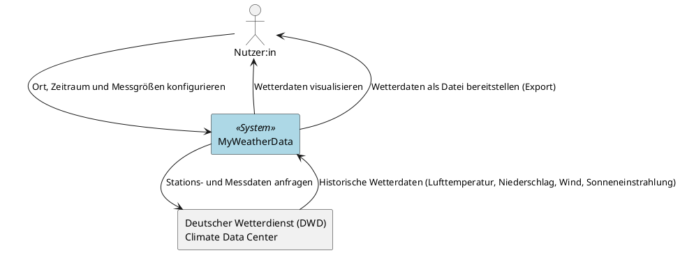
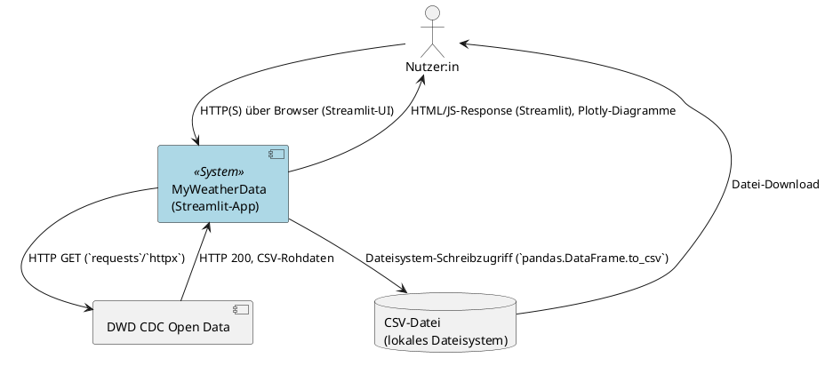

# PlantUML-Notation für Kontextsichten

Detaillierte Notationsregeln und vollständige Beispiele für die Kontextsicht (fachlich + technisch), reines UML ohne C4-Includes.

## Legende / Elemente

| Element | PlantUML-Syntax | Verwendung |
|---|---|---|
| Menschlicher Akteur | `actor "Nutzer:in" as Nutzer` | Rollen, die das System bedienen |
| Betrachtetes System | `rectangle "MyWeatherData" as System` (fachlich) bzw. `component "MyWeatherData" as System` (technisch) | Das System, dessen Kontext abgegrenzt wird |
| Nachbarsystem (fachlich) | `rectangle "<Name>" as <Alias>` | Externes System ohne technische Details |
| Nachbarsystem (technisch) | `component "<Name>"` oder `database "<Name>"` | Externes System/Datenspeicher mit technischer Schnittstelle |
| Kommunikationsbeziehung | `A --> B : <Beschriftung>` | Eine Richtung pro Pfeil; Rückantwort als eigener Pfeil |
| Hervorhebung des Systems | `skinparam rectangle<<System>> { BackgroundColor LightBlue }` + `rectangle "..." as System <<System>>` | Optisches Absetzen von den Nachbarn |

## Regeln

1. Jedes Diagramm beginnt mit `@startuml <Diagrammname>` und endet mit `@enduml`.
2. Genau ein betrachtetes System pro Kontextdiagramm (Blackbox – keine internen Komponenten zeigen, das ist Aufgabe der Bausteinsicht).
3. Pro Kommunikationsbeziehung ein Pfeil, eine Richtung, eine Beschriftung. Bidirektionale Kommunikation = zwei Pfeile.
4. Fachliches Diagramm: Beschriftungen beschreiben **was** ausgetauscht wird (fachliche Information), niemals **wie** (kein Protokoll, kein Dateiformat, kein Bibliotheksname).
5. Technisches Diagramm: Beschriftungen beschreiben **wie** die fachliche Beziehung technisch realisiert ist (Protokoll, Format, Schnittstellenart), abgeleitet aus dem Techstack.
6. Konsistenz: Jede Beziehung aus dem fachlichen Diagramm muss im technischen Diagramm wiederzufinden sein (ggf. feiner granular, aber nicht widersprüchlich).
7. Keine Annahmen über nicht dokumentierte Nachbarsysteme treffen – bei Unklarheit in Epics/User Stories/FRs nachschlagen bzw. beim Erstellen nachfragen.

## Vollständiges Beispiel (Projekt MyWeatherData)

Basierend auf [EPIC-001](../../../../req/epic/EPIC-001-datenimport-export-dwd.md) und [techstack-uebersicht.md](../../../../doc/techstack/techstack-uebersicht.md).

### Fachlicher Kontext

### Technischer Kontext

## Typische Fehler beim Review

| Fehler | Beispiel | Korrektur |
|---|---|---|
| Technologie im fachlichen Kontext | "System --> DWD : HTTP GET Stationsliste" im fachlichen Diagramm | Beschriftung auf fachliche Information kürzen: "Stationsliste anfragen" |
| Fehlende Gegenrichtung | Nur `System --> DWD`, aber keine Antwort modelliert | Zweiten Pfeil `DWD --> System : <Antwortdaten>` ergänzen |
| Interne Komponente im Kontextdiagramm | Import-Client, Datenbank und UI einzeln im Kontextdiagramm | Auf Blackbox-Sicht reduzieren, Details gehören in die Bausteinsicht |
| Inkonsistente Systemgrenze | Fachlich 2 Nachbarsysteme, technisch 3 | Beide Diagramme auf dieselben Kommunikationspartner abgleichen |
| C4-Includes verwendet | `!include C4_Context.puml` | Entfernen, reines UML (`actor`/`rectangle`/`component`) verwenden |
