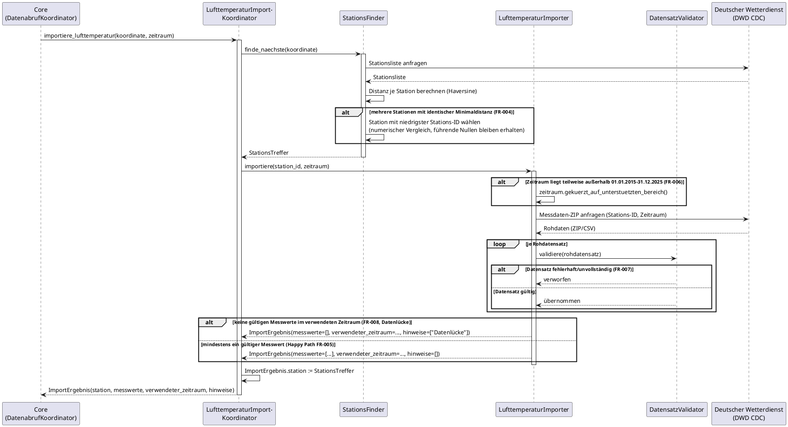

# Dynamische Sichten – MyWeatherData

Dieser Ordner enthält die dynamischen Architektursichten (arc42-Kapitel 5, Ablaufdarstellungen) des Systems **MyWeatherData**, jeweils als Markdown-Beschreibung mit eingebettetem PlantUML-Sequenzdiagramm. Sie ergänzen die [statischen Sichten](../statische_sichten/) um den zeitlichen Ablauf konkreter Szenarien und zeigen Nachrichtenaustausch zwischen den dort definierten Klassen.

## Sequenzsicht: Import Lufttemperatur (FR-001, FR-004, FR-005, FR-006, FR-007, FR-008)

Zeigt den Ablauf eines Lufttemperatur-Imports über die [Klassensicht Import-Client](../statische_sichten/klassensicht.md#klassensicht-import-client), ausgelöst durch `Core` über den Port `ImportSchnittstelle` (kanonisch definiert in der [Klassensicht Core](../statische_sichten/klassensicht.md#klassensicht-core-business-logik)). Neben dem Happy Path (FR-001 Stationssuche, FR-005 Import) sind die im aktuellen Vertical Slice umgesetzten Randfälle als `alt`-Blöcke dargestellt: FR-004 (Distanz-Gleichstand), FR-006 (Zeitraum-Kürzung), FR-007 (fehlerhafte Datensätze) und FR-008 (Datenlücke).

| Schritt | Beteiligte | FR-Bezug |
|---|---|---|
| `Core` löst Import über den Core-eigenen Port `ImportSchnittstelle` aus | Core, LufttemperaturImportKoordinator | FR-001, FR-005 |
| Stationsliste abrufen, Distanz berechnen, nächste Station ermitteln | StationsFinder, DWD | FR-001 |
| Bei Distanz-Gleichstand: Station mit niedrigster Stations-ID wählen | StationsFinder | FR-004 |
| Zeitraum ggf. auf unterstützten Bereich kürzen | LufttemperaturImporter | FR-006 |
| Messdaten anfragen und je Datensatz validieren, fehlerhafte verwerfen | LufttemperaturImporter, DatensatzValidator, DWD | FR-005, FR-007 |
| Bei leerem Ergebnis im Zeitraum: `ImportErgebnis` mit leerer Messwerteliste und Hinweis | LufttemperaturImporter | FR-008 |
| `LufttemperaturImportKoordinator` ergänzt `ImportErgebnis.station` und liefert das Gesamtergebnis an `Core` zurück | LufttemperaturImportKoordinator | FR-001, FR-005 |

**Nicht Teil dieses Diagramms:** FR-002 (Koordinate außerhalb Deutschlands) und FR-003 (Stationsliste nicht abrufbar) sind gemäß [pjm/vertical-slice-prototyp.md](../../pjm/vertical-slice-prototyp.md) auf einen Folge-Slice verschoben (siehe auch die entsprechenden Hinweise in [klassensicht.md](../statische_sichten/klassensicht.md#klassensicht-import-client)) und werden hier nicht dargestellt. Ebenso nicht dargestellt: der Core-weite Ablauf (Entscheidung Import vs. lokale Abfrage, Speicherung, Visualisierungs-Trigger) – dieser bleibt Aufgabe von `DatenabrufKoordinator` (siehe [Klassensicht Core](../statische_sichten/klassensicht.md#klassensicht-core-business-logik)) und ist nicht Gegenstand dieser Sequenzsicht.

**Konsistenz zur Klassensicht:** Alle in diesem Diagramm gezeigten Klassen (`LufttemperaturImportKoordinator`, `StationsFinder`, `LufttemperaturImporter`, `DatensatzValidator`) sowie die Struktur von `ImportErgebnis` entsprechen der [Klassensicht Import-Client](../statische_sichten/klassensicht.md#klassensicht-import-client); der Port `ImportSchnittstelle` entspricht der kanonischen Definition in der [Klassensicht Core](../statische_sichten/klassensicht.md#klassensicht-core-business-logik).
