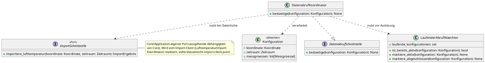
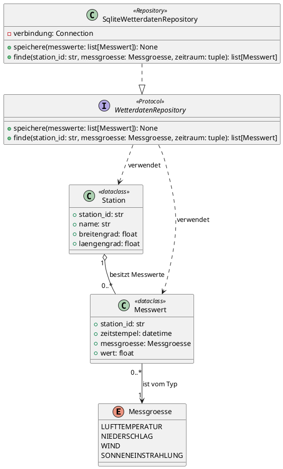
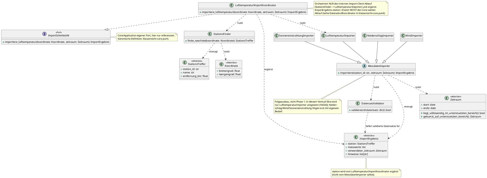
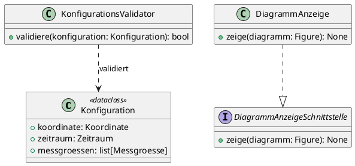
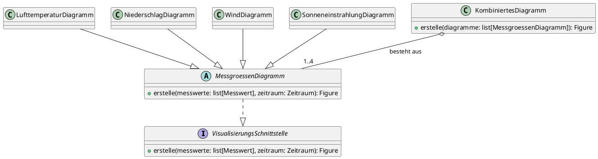

# Klassensicht – MyWeatherData

Diese Sicht vertieft einzelne Komponenten/Teilkomponenten aus der [Komponentensicht](./komponentensicht.md) auf Ebene der Klassen. Sie zeigt jeweils nur das **Innenleben** einer Komponente; externe Beziehungen zu anderen Komponenten oder Nachbarsystemen sind bereits in der Komponentensicht dargestellt und werden hier nicht wiederholt.

## Auswahl der verfeinerten Komponenten

Gemäß dem [Kriterium für Klassenverfeinerung](../../.github/skills/ar-klassen-sicht/SKILL.md) erhalten folgende Komponenten aus der Komponentensicht ein eigenes Klassendiagramm:

| Komponente | Kriterium erfüllt | Begründung |
|---|---|---|
| Core (Business-Logik) | ✅ ≥2 Klassen mit eigenständiger Verantwortung | Entscheidet zwischen Import und lokaler Abfrage (FR-049) und verhindert parallele Datenabrufe für dieselbe Konfiguration (FR-048) als zwei zusammenspielende, eigenständige Klassen – zentraler Koordinator des Datenstroms zwischen UI, Import-Client, Datenhaltung und Visualisierung |
| Datenhaltung (SQLite) | ✅ eigenes Datenmodell + Schnittstelle | Verwaltet die dauerhaften Entitäten `Station`/`Messwert`, die von Import-Client und Core referenziert werden; definiert das `WetterdatenRepository`-Interface (FR-025 bis FR-036) |
| Import-Client | ✅ ≥2 Klassen mit eigenständiger Verantwortung | Kapselt Stationssuche, Datenabruf je Messgröße und Validierung als eigenständige, zusammenspielende Klassen (FR-001 bis FR-020) |
| UI (Streamlit) | ✅ ≥2 Klassen mit eigenständiger Verantwortung | Validierung der Konfiguration vor Übergabe an `Core` (FR-037 bis FR-045, FR-047) ist ein eigenständiges Klassenzusammenspiel aus Wertobjekt und Validator – keine reine Widget-Orchestrierung |
| Visualisierung (Plotly) | ✅ ≥2 Klassen mit eigenständiger Verantwortung | Je Messgröße eigene Darstellungsregeln (Datenlücken, keine Interpolation, messgrößenspezifische Nullwerte, FR-050 bis FR-067) sowie eine eigenständige Zusammenführung mehrerer Diagramme (FR-068 bis FR-072) |

## Klassensicht: Core (Business-Logik)

Verfeinert die Komponente `Core (Business-Logik)` (siehe [Komponentensicht](./komponentensicht.md#ebene-2-whitebox-der-komponente-core-business-logik)) mit ihrer Teilkomponente Import-Orchestrierung/Abfrage-Orchestrierung. `Core` ist seit Einführung der zentralen Koordinationskomponente der alleinige Vermittler des Datenstroms zwischen `UI`, `Import-Client`, `Datenhaltung` und `Visualisierung` – die frühere Ablaufsteuerung aus der UI-Klassensicht (Entscheidung Import vs. lokale Abfrage, Verhinderung paralleler Abrufe) ist hierher verlagert worden.

| Klasse/Interface | Verantwortung | Zuordnung zur Teilkomponente | Wichtigste Attribute/Methoden |
|---|---|---|---|
| `DatenabrufSchnittstelle` | Externe Schnittstelle für die von der `UI` übergebene, bereits validierte Konfiguration; einziger Eintrittspunkt von außen in `Core` | Import-Orchestrierung | `bestaetige(konfiguration)` |
| `DatenabrufKoordinator` | Löst bei gültiger, von der UI übergebener Konfiguration den Datenabruf aus und entscheidet anhand des lokalen Datenbestands zwischen Import-Orchestrierung (Datenlücke) und direkter Abfrage-Orchestrierung (Daten bereits vollständig vorhanden) | Import-Orchestrierung / Abfrage-/Visualisierungs-Orchestrierung | `bestaetige(konfiguration)` (FR-046, FR-049) |
| `LaufenderAbrufWaechter` | Verhindert einen zweiten, parallelen Datenabruf für eine Konfiguration, für die bereits ein Abruf läuft | Import-Orchestrierung | `ist_bereits_aktiv(...)`, `markiere_aktiv(...)`, `markiere_abgeschlossen(...)` (FR-048) |
| `ImportSchnittstelle` | Core/Application-eigener Port für den ausgehenden Aufruf an `Import-Client`; wird dort von `LufttemperaturImportKoordinator` realisiert | Import-Orchestrierung | `importiere_lufttemperatur(koordinate, zeitraum)` (FR-001, FR-005) |

**Hinweis zu gemeinsam genutzten Typen:** `Konfiguration` ist in der [Klassensicht UI](#klassensicht-ui-streamlit) definiert und wird hier nur referenziert, nicht erneut definiert. `ImportSchnittstelle` ist die kanonische, Core-eigene Definition des Ports; die [Klassensicht Import-Client](#klassensicht-import-client) referenziert ihn nur.

**Konsistenz zur Komponentensicht:** `DatenabrufSchnittstelle` bildet die eingehende externe Beziehung `UI --> Core`/`UI --> ImportOrch : Konfiguration bestätigen (Datenabruf anstoßen)` explizit als Schnittstelle ab und wird von `DatenabrufKoordinator` realisiert (`..|>`); `DatenabrufKoordinator.bestaetige(...)` ist der einzige Eintrittspunkt der Teilkomponente `Import-Orchestrierung` (Ebene 2) und realisiert dort die Entscheidung zwischen Import (`ImportOrch --> Import`) und der internen Delegation an `Abfrage-/Visualisierungs-Orchestrierung` (`ImportOrch --> AbfrageOrch`) gemäß FR-049. `ImportSchnittstelle` bildet die ausgehende Beziehung `Core --> Import-Client`/`Core --> Stationssuche : Import anstoßen (inkl. Koordinate, Zeitraum)` explizit als von Core besessenen Port ab, den der Import-Client realisiert (umgekehrte Owner-Richtung gegenüber `DatenabrufSchnittstelle`, da Core hier die aufrufende statt die aufgerufene Seite ist). Auf Ebene 1 entspricht dies der von `UI --> Core` ausgehenden Anstoß-Beziehung und den daraus resultierenden Beziehungen `Core --> Import-Client` bzw. `Core --> Datenhaltung`. Die übrigen externen Beziehungen zu `Import-Client`, `Datenhaltung` und `Visualisierung` aus der Komponentensicht bleiben unverändert und werden hier nicht erneut dargestellt (sie sind ausgehende Aufrufe von `Core` bzw. reine Rückgabewerte und daher keine eigenen Interfaces).

## Klassensicht: Datenhaltung (SQLite)

Verfeinert die Komponente `Datenhaltung (SQLite)` (siehe [Komponentensicht](./komponentensicht.md#ebene-2-whitebox-der-komponente-datenhaltung-sqlite)) mit ihren Teilkomponenten Speicherlogik, Duplikatprüfung und Abfragelogik.

| Klasse/Interface/Enum | Verantwortung | Zuordnung zur Teilkomponente | Wichtigste Attribute/Methoden |
|---|---|---|---|
| `Messgroesse` (enum) | Feste Menge der vier unterstützten Messgrößen | – (gemeinsam genutzter Typ) | `LUFTTEMPERATUR`, `NIEDERSCHLAG`, `WIND`, `SONNENEINSTRAHLUNG` |
| `Station` | Fachliche Entität einer DWD-Wetterstation | Speicherlogik/Abfragelogik | `station_id`, `name`, `breitengrad`, `laengengrad` |
| `Messwert` | Einzelner Messwert einer Station zu einem Zeitpunkt/einer Messgröße | Speicherlogik/Abfragelogik | `station_id`, `zeitstempel`, `messgroesse`, `wert` |
| `WetterdatenRepository` | Schnittstelle für Schreib-/Lesezugriff auf gespeicherte Wetterdaten | Speicherlogik + Abfragelogik | `speichere(...)`, `finde(...)` |
| `SqliteWetterdatenRepository` | Konkrete SQLite-Implementierung des Repositorys; prüft beim Speichern anhand des Unique-Constraints (Station, Messgröße, Zeitstempel), ob ein Duplikat vorliegt (FR-029 bis FR-032), und beantwortet Abfragen inkl. leerem Ergebnis/Hinweis (FR-033 bis FR-036) | Speicherlogik + Duplikatprüfung + Abfragelogik | `speichere(...)`, `finde(...)` |

**Konsistenz zur Komponentensicht:** `speichere()` deckt die Teilkomponenten Speicherlogik und Duplikatprüfung ab (FR-025 bis FR-032), `finde()` die Abfragelogik (FR-033 bis FR-036). Die externe Beziehung der Komponente `Datenhaltung` zu `Core` (statt zuvor direkt zu Import-Client, UI und Visualisierung) aus der Komponentensicht bleibt unverändert und wird hier nicht erneut dargestellt.

## Klassensicht: Import-Client

Verfeinert die Komponente `Import-Client` (siehe [Komponentensicht](./komponentensicht.md#ebene-2-whitebox-der-komponente-import-client)) mit ihren Teilkomponenten Stationssuche, Datenabruf und Validierung/Aufbereitung.

| Klasse/Interface | Verantwortung | Zuordnung zur Teilkomponente | Wichtigste Attribute/Methoden |
|---|---|---|---|
| `ImportSchnittstelle` | Core/Application-eigener Port (kanonisch in [Klassensicht Core](#klassensicht-core-business-logik) definiert), hier nur referenziert; einziger Eintrittspunkt von außen in `Import-Client` | Stationssuche | `importiere_lufttemperatur(koordinate, zeitraum)` |
| `LufttemperaturImportKoordinator` | Realisiert `ImportSchnittstelle`; orchestriert NUR den internen Ablauf `StationsFinder` → `LufttemperaturImporter` und ergänzt `ImportErgebnis.station` – nicht der Core-weite Ablauf (siehe `DatenabrufKoordinator`) | Stationssuche/Datenabruf (Fassade) | `importiere_lufttemperatur(koordinate, zeitraum)` (FR-001, FR-005) |
| `Koordinate` | Wertobjekt für Breiten-/Längengrad einer Nutzereingabe | Stationssuche | `breitengrad`, `laengengrad` |
| `Zeitraum` | Wertobjekt für einen Zeitraum; prüft/kürzt ihn auf 01.01.2015–31.12.2025 | Datenabruf | `start`, `ende`, `liegt_vollstaendig_im_unterstuetzten_bereich()`, `gekuerzt_auf_unterstuetzten_bereich()` (FR-006, FR-010, FR-014, FR-018) |
| `StationsTreffer` | Ergebnis der Stationssuche: nächstgelegene Station mit Entfernung | Stationssuche | `station_id`, `name`, `entfernung_km` (FR-001, FR-004) |
| `StationsFinder` | Ermittelt zu einer Koordinate die nächstgelegene DWD-Station innerhalb Deutschlands | Stationssuche | `finde_naechste(koordinate)` (FR-001, FR-004; FR-002 zurückgestellt, siehe [pjm/vertical-slice-prototyp.md](../../pjm/vertical-slice-prototyp.md)) |
| `MessdatenImporter` (abstrakt) | Gemeinsamer Ablauf für den Import einer Messgröße: Zeitraumprüfung/-kürzung, Abruf, Validierung | Datenabruf | `importiere(station_id, zeitraum)` (Folgeausbau, nicht Phase 1 – siehe Hinweis im Diagramm) |
| `LufttemperaturImporter` / `NiederschlagImporter` / `WindImporter` / `SonneneinstrahlungImporter` | Messgrößen-spezifische Realisierung des Abrufs und Parsens gemäß jeweiligem DWD-Rohdatenformat; in diesem Vertical Slice wird nur `LufttemperaturImporter` umgesetzt | Datenabruf | erbt `importiere(...)` (FR-005/006, FR-009/010, FR-013/014, FR-017/018) |
| `DatensatzValidator` | Erkennt fehlerhafte/unvollständige Datensätze und markiert/überspringt sie | Validierung/Aufbereitung | `validiere(rohdatensatz)` (FR-007, FR-011, FR-015, FR-019) |
| `ImportErgebnis` | Ergebnis eines Importvorgangs: ausgewählte Station, validierte Messwerte, tatsächlich verwendeter (ggf. gekürzter) Zeitraum und Hinweise (Kürzung/Datenlücke) | Validierung/Aufbereitung | `station`, `messwerte`, `verwendeter_zeitraum`, `hinweise` (FR-001, FR-006, FR-008, FR-012, FR-016, FR-020) |

**Hinweis zu gemeinsam genutzten Typen:** `ImportErgebnis.messwerte` referenziert die in der [Klassensicht Datenhaltung](#klassensicht-datenhaltung-sqlite) definierte Klasse `Messwert` (keine erneute Definition, um Duplikate zu vermeiden). `ImportSchnittstelle` ist Core-eigen (siehe dort); hier nur referenziert.

**Konsistenz zur Komponentensicht:** `ImportSchnittstelle` bildet die eingehende externe Beziehung `Core --> Import-Client : Import anstoßen`/`Core --> Stationssuche : Import anstoßen (inkl. Koordinate, Zeitraum)` explizit als Schnittstelle ab und wird von `LufttemperaturImportKoordinator` realisiert (`..|>`); die Owner-Definition des Ports liegt jedoch bei `Core` (siehe dort), nicht bei `Import-Client`. Die Zuordnung der übrigen Klassen zu den drei Teilkomponenten (Stationssuche, Datenabruf, Validierung/Aufbereitung) entspricht der Ebene-2-Verfeinerung in der Komponentensicht. Die ausgehende Beziehung `Import-Client --> Core` (Aufbereitete Messdaten übergeben, Rückgabewert des Imports) sowie die Beziehungen zu `DWD` bleiben unverändert und werden hier nicht erneut dargestellt.

## Klassensicht: UI (Streamlit)

Verfeinert die Komponente `UI (Streamlit)` (siehe [Komponentensicht](./komponentensicht.md#ebene-1-whitebox-gesamtsystem)). Die Komponente hat in der Komponentensicht kein eigenes Ebene-2-Diagramm, da die Zerlegung in Teilkomponenten dort keinen Mehrwert bietet – auf Klassenebene zeigt sich jedoch ein eigenständiges Zusammenspiel aus Wertobjekt und Validator zur Konfigurationsprüfung (FR-037 bis FR-045, FR-047), das eine Klassensicht rechtfertigt. Die frühere Abruf-Koordination (Entscheidung Import vs. lokale Abfrage, Verhinderung paralleler Abrufe, FR-046, FR-048, FR-049) ist in die [Klassensicht Core](#klassensicht-core-business-logik) verlagert worden.

| Klasse/Interface | Verantwortung | Wichtigste Attribute/Methoden |
|---|---|---|
| `Konfiguration` | Wertobjekt für Ort, Zeitraum und ausgewählte Messgrößen einer Nutzereingabe | `koordinate`, `zeitraum`, `messgroessen` |
| `KonfigurationsValidator` | Prüft Vollständigkeit und Gültigkeit von Ort, Zeitraum und Messgrößen (FR-037 bis FR-045, FR-047) | `validiere(konfiguration)` |
| `DiagrammAnzeigeSchnittstelle` | Externe Schnittstelle für das von `Core` gelieferte, fertige Diagramm; einziger Eintrittspunkt von außen in `UI` für die Darstellung | `zeige(diagramm)` |
| `DiagrammAnzeige` | Nimmt das von `Core` gelieferte Diagramm entgegen und stellt es in der Streamlit-Oberfläche dar (FR-050, FR-055, FR-059, FR-064) | `zeige(diagramm)` |

**Hinweis zu gemeinsam genutzten Typen:** `Konfiguration.koordinate`/`.zeitraum` referenzieren die in der [Klassensicht Import-Client](#klassensicht-import-client) definierten Klassen `Koordinate`/`Zeitraum`, `Konfiguration.messgroessen` die in der [Klassensicht Datenhaltung](#klassensicht-datenhaltung-sqlite) definierte `Messgroesse` (keine erneute Definition). `Konfiguration` selbst wird zusätzlich vom `DatenabrufKoordinator` der [Klassensicht Core](#klassensicht-core-business-logik) referenziert.

**Konsistenz zur Komponentensicht:** `KonfigurationsValidator` sichert die Vorbedingung für die in Ebene 1 gezeigte Beziehung `UI --> Core` (Import/Abfrage anstoßen) ab – erst eine gültige Konfiguration wird an `Core` übergeben. `DiagrammAnzeigeSchnittstelle` bildet die eingehende externe Beziehung `Core --> UI : Diagramm anzeigen` explizit als Schnittstelle ab und wird von `DiagrammAnzeige` realisiert (`..|>`). Die frühere Ablaufsteuerung (Entscheidung Import vs. lokale Abfrage, Verhinderung paralleler Abrufe) ist in die [Klassensicht Core](#klassensicht-core-business-logik) verlagert worden.

## Klassensicht: Visualisierung (Plotly)

Verfeinert die Komponente `Visualisierung (Plotly)` (siehe [Komponentensicht](./komponentensicht.md#ebene-1-whitebox-gesamtsystem)). Ebenso ohne eigenes Ebene-2-Diagramm in der Komponentensicht, aber mit eigenständigem Klassenzusammenspiel (messgrößenspezifische Diagramme plus deren Zusammenführung, FR-050 bis FR-072).

| Klasse/Interface | Verantwortung | Wichtigste Attribute/Methoden |
|---|---|---|
| `VisualisierungsSchnittstelle` | Externe Schnittstelle für die von `Core` übergebenen Wetterdaten; einziger Eintrittspunkt von außen in `Visualisierung` | `erstelle(messwerte, zeitraum)` |
| `MessgroessenDiagramm` (abstrakt) | Gemeinsamer Ablauf: Zeitreihe rendern, Datenlücken erkennbar darstellen, keine Interpolation fehlender Werte, Hinweis bei fehlenden Daten | `erstelle(messwerte, zeitraum)` |
| `LufttemperaturDiagramm` | Lufttemperaturverlauf inkl. erkennbarer Datenlücken (FR-050 bis FR-054) | erbt `erstelle(...)` |
| `NiederschlagDiagramm` | Niederschlagsverlauf; niederschlagsfreie Perioden werden als Nullwert (nicht als Lücke) dargestellt (FR-055 bis FR-058) | erbt `erstelle(...)`, überschreibt Nullwert-Behandlung |
| `WindDiagramm` | Windgeschwindigkeitsverlauf inkl. erkennbarer Datenlücken (FR-059 bis FR-063) | erbt `erstelle(...)` |
| `SonneneinstrahlungDiagramm` | Sonneneinstrahlungsverlauf; Nachtstunden werden als Nullwert (nicht als Lücke) dargestellt (FR-064 bis FR-067) | erbt `erstelle(...)`, überschreibt Nullwert-Behandlung |
| `KombiniertesDiagramm` | Führt die Diagramme mehrerer ausgewählter Messgrößen überschneidungsfrei zusammen; bei genau einer Messgröße wird nur deren Diagramm gezeigt (FR-068 bis FR-072) | `erstelle(diagramme)` |

**Konsistenz zur Komponentensicht:** `VisualisierungsSchnittstelle` bildet die eingehende externe Beziehung `Core --> Visualisierung : Wetterdaten für Diagramm` explizit als Schnittstelle ab und wird von `MessgroessenDiagramm` realisiert (`..|>`), von wo aus die Realisierung an die vier messgrößenspezifischen Unterklassen vererbt wird. Die ausgehende Beziehung `Visualisierung --> Core` (Diagramm, Rückgabewert) aus Ebene 1 (zuvor `Visualisierung --> UI`) bleibt unverändert; `messwerte`/`zeitraum` referenzieren die in Datenhaltung bzw. Import-Client definierten Klassen `Messwert`/`Zeitraum`.

## Selbstcheck (Schnell-Checkliste)

- [x] Jede Klasse ist eindeutig einer Komponente/Teilkomponente aus der Komponentensicht zugeordnet
- [x] Jede eingehende externe Beziehung aus der Komponentensicht ist als explizites `interface`-Element modelliert und wird von der zuständigen Klasse realisiert (`..|>`) (`DatenabrufSchnittstelle`/`DatenabrufKoordinator`, `ImportSchnittstelle`/`LufttemperaturImportKoordinator`, `WetterdatenRepository`/`SqliteWetterdatenRepository`, `DiagrammAnzeigeSchnittstelle`/`DiagrammAnzeige`, `VisualisierungsSchnittstelle`/`MessgroessenDiagramm`)
- [x] Klassendiagramme existieren genau dort, wo das Kriterium für Klassenverfeinerung zutrifft (Core, Datenhaltung, Import-Client, UI, Visualisierung)
- [x] Jede Klasse hat eine eindeutige, überlappungsfreie Verantwortung
- [x] Nur architektur-relevante Attribute/Methoden gezeigt (keine vollständige Implementierung)
- [x] Stereotypen (`<<dataclass>>`, `<<Protocol>>`, `<<Repository>>`) sind bei zutreffenden Python-Konstrukten gesetzt
- [x] Beziehungstyp (Vererbung/Realisierung/Assoziation/Aggregation/Komposition/Abhängigkeit) ist jeweils fachlich korrekt gewählt
- [x] Multiplizitäten und Beschriftungen an Assoziationen sind vorhanden und sinnvoll
- [x] Externe Beziehungen der verfeinerten Komponenten stimmen mit der Komponentensicht überein (nicht erneut dargestellt)
- [x] Reines UML ohne C4-Includes, gültige `@startuml`/`@enduml`-Blöcke
- [x] Diagramme liegen unter `arc/statische_sichten/` und sind in `klassensicht.md` eingebunden
