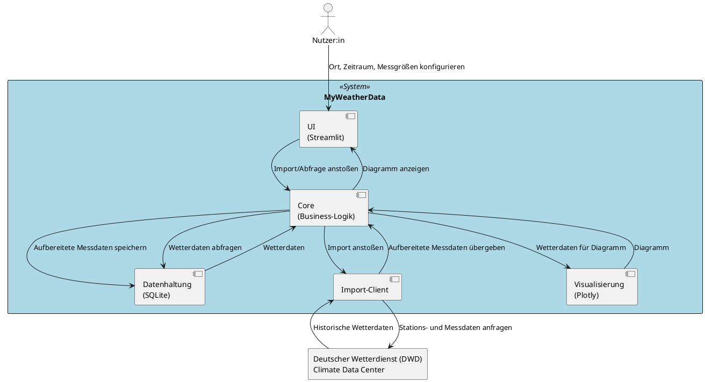
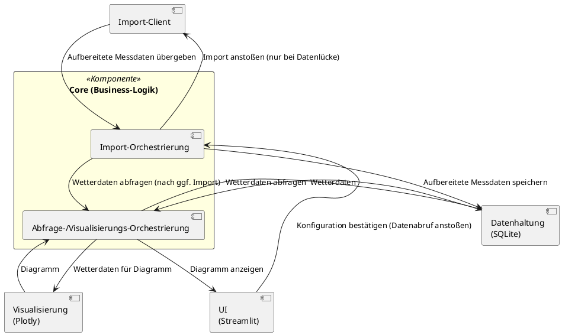
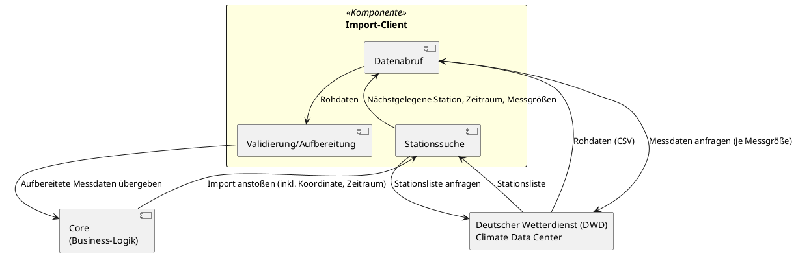
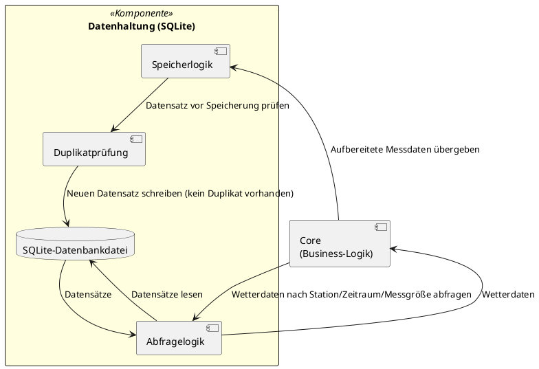

# Komponentensicht – MyWeatherData

Diese Sicht zerlegt das System **MyWeatherData** (Blackbox aus der [Kontextsicht](./kontextsicht.md)) in seine internen Bausteine (arc42-Kapitel 5, Bausteinsicht) und zeigt deren Verantwortlichkeiten, Schnittstellen und Beziehungen zueinander sowie zu den bereits bekannten Nachbarn (Nutzer:in, DWD).

## Komponenten im Überblick

| Komponente | Verantwortung | Zugehöriges Epic |
|---|---|---|
| UI (Streamlit) | Konfigurationsoberfläche für Ort, Zeitraum, Messgrößen; stößt Import/Abfrage an; zeigt Diagramme | [EPIC-003](../../req/epic/EPIC-003-ui-konfiguration.md) |
| Core (Business-Logik) | Koordiniert den Datenstrom zwischen UI, Import-Client, Datenhaltung und Visualisierung; enthält die fachliche Ablaufsteuerung von Import- und Abfrage-/Visualisierungs-Workflows | Übergreifend ([EPIC-001](../../req/epic/EPIC-001-datenimport-export-dwd.md)–[EPIC-004](../../req/epic/EPIC-004-visualisierung.md)) |
| Import-Client | Ermittelt nächstgelegene Station, ruft historische Messdaten vom DWD ab, validiert/bereitet sie auf | [EPIC-001](../../req/epic/EPIC-001-datenimport-export-dwd.md) |
| Datenhaltung (SQLite) | Speichert aufbereitete Messdaten dauerhaft, vermeidet Duplikate, stellt Abfrageschnittstelle bereit | [EPIC-002](../../req/epic/EPIC-002-lokale-datenhaltung.md) |
| Visualisierung (Plotly) | Erzeugt Zeitreihendiagramme aus den abgefragten Wetterdaten | [EPIC-004](../../req/epic/EPIC-004-visualisierung.md) |

## Ebene 1: Whitebox Gesamtsystem

| # | Von | Nach | Beziehung | Bezug zur Kontextsicht |
|---|---|---|---|---|
| 1 | Nutzer:in | UI | Ort, Zeitraum, Messgrößen konfigurieren | Fachlich #1 |
| 2 | UI | Core | Import/Abfrage anstoßen | verfeinert Fachlich #1/#2/#3 |
| 3 | Core | Import-Client | Import anstoßen | verfeinert Fachlich #3 |
| 4 | Import-Client | DWD | Stations- und Messdaten anfragen | Fachlich #3 |
| 5 | DWD | Import-Client | Historische Wetterdaten | Fachlich #4 |
| 6 | Import-Client | Core | Aufbereitete Messdaten übergeben | intern (EPIC-001) |
| 7 | Core | Datenhaltung | Aufbereitete Messdaten speichern | intern (EPIC-002) |
| 8 | Core | Datenhaltung | Wetterdaten abfragen | intern (EPIC-002/EPIC-003) |
| 9 | Datenhaltung | Core | Wetterdaten | intern (EPIC-002) |
| 10 | Core | Visualisierung | Wetterdaten für Diagramm | intern (EPIC-004) |
| 11 | Visualisierung | Core | Diagramm | verfeinert Fachlich #2 |
| 12 | Core | UI | Diagramm anzeigen | verfeinert Fachlich #2 |

## Ebene 2: Whitebox der Komponente „Core (Business-Logik)“

Die Komponente `Core` wird vertieft, da sie von mehreren Epics/FRs mit unterschiedlichen Anforderungen an ihr internes Verhalten referenziert wird (Entscheidung Import vs. lokale Abfrage FR-049, Verhinderung paralleler Abrufe FR-048) und zwei fachlich unterscheidbare, eigenständige Ablaufsteuerungen kapselt: Import-Orchestrierung und Abfrage-/Visualisierungs-Orchestrierung. Sie koordiniert dabei den gesamten Datenstrom zwischen UI, Import-Client, Datenhaltung und Visualisierung – keine dieser Komponenten kommuniziert mehr direkt mit einer anderen.

| Teilkomponente | Verantwortung |
|---|---|
| Import-Orchestrierung | Einziger Eintrittspunkt für die bestätigte Konfiguration der UI; entscheidet anhand des lokalen Datenbestands, ob ein Import nötig ist, stößt ihn bei Bedarf beim Import-Client an, übergibt aufbereitete Messdaten zur Speicherung an die Datenhaltung und delegiert anschließend an die Abfrage-/Visualisierungs-Orchestrierung (FR-046, FR-048, FR-049) |
| Abfrage-/Visualisierungs-Orchestrierung | Fragt Wetterdaten aus der Datenhaltung ab, lässt daraus ein Diagramm erzeugen und liefert es an die UI zurück |

**Konsistenz zu Ebene 1:** Die externen Beziehungen zu `UI` (2× eingehend über `ImportOrch`, 1× ausgehend über `AbfrageOrch`, in Ebene 1 aggregiert als `UI --> Core` bzw. `Core --> UI`), zu `Import` (`ImportOrch --> Import`, `Import --> ImportOrch`), zu `DB` (`ImportOrch --> DB`, `AbfrageOrch --> DB`, `DB --> AbfrageOrch`, aggregiert je Ziel-Workflow) und zu `Viz` (`AbfrageOrch --> Viz`, `Viz --> AbfrageOrch`) bleiben in Zahl und Richtung identisch zu Ebene 1, lediglich feiner auf die zwei Orchestrierungs-Teilkomponenten aufgelöst. Die interne Delegation `ImportOrch --> AbfrageOrch` bildet die in FR-049 geforderte Entscheidung zwischen Import und lokaler Abfrage innerhalb von `Core` ab und ist keine externe Beziehung.

## Ebene 2: Whitebox der Komponente „Import-Client“

Die Komponente `Import-Client` wird vertieft, da sie mehrere fachlich unterscheidbare Verarbeitungsschritte kapselt (Stationssuche, Datenabruf je Messgröße, Validierung/Aufbereitung) und eigene Fehler-/Sonderfälle behandelt (z. B. Koordinate außerhalb Deutschlands, Datenlücken, fehlerhafte Datensätze je Messgröße gemäß FR-001 bis FR-020).

| Teilkomponente | Verantwortung |
|---|---|
| Stationssuche | Ermittelt zu einer Koordinate die nächstgelegene DWD-Station innerhalb Deutschlands (FR-001, FR-002, FR-004) |
| Datenabruf | Ruft historische Messdaten je Messgröße (Lufttemperatur, Niederschlag, Wind, Sonneneinstrahlung) für Station/Zeitraum ab (FR-005, FR-009, FR-013, FR-017) |
| Validierung/Aufbereitung | Erkennt fehlerhafte/unvollständige Datensätze und Datenlücken, bereitet valide Daten für die Speicherung auf (FR-007, FR-008, FR-011, FR-012, FR-015, FR-016, FR-019, FR-020) |

**Konsistenz zu Ebene 1:** Die externen Beziehungen zu `DWD` (2×) sowie die ein-/ausgehende Beziehung von `Core` bleiben in Zahl und Richtung identisch zu Ebene 1 (`Import --> DWD`, `DWD --> Import`, `Core --> Import`, `Import --> Core`), lediglich feiner auf die Teilkomponenten aufgelöst.

## Ebene 2: Whitebox der Komponente „Datenhaltung (SQLite)“

Die Komponente `Datenhaltung` wird vertieft, da sie drei fachlich unterscheidbare Verarbeitungsschritte kapselt (Speichern, Duplikatprüfung, Abfrage; siehe US-007, US-008, US-009) mit jeweils eigenen Anforderungen (FR-025 bis FR-036).

| Teilkomponente | Verantwortung |
|---|---|
| Speicherlogik | Nimmt aufbereitete Messdaten von der `Core`-Komponente entgegen und übergibt sie zur Duplikatprüfung (FR-025, FR-026, FR-028) |
| Duplikatprüfung | Prüft vor dem Schreiben, ob ein Datensatz für Station/Zeitpunkt/Messgröße bereits existiert (FR-Duplikatvermeidung, US-008) |
| Abfragelogik | Beantwortet Abfragen der `Core`-Komponente nach Station, Zeitraum und Messgröße (für UI und Visualisierung), inkl. leerem Ergebnis/Hinweis bei fehlenden Daten (FR-033 bis FR-036) |
| SQLite-Datenbankdatei | Persistenter Speicherort der Wetterdaten (FR-027, dauerhafte Verfügbarkeit über App-Neustarts hinweg) |

**Konsistenz zu Ebene 1:** Die externen Beziehungen `Core --> DB` (2×, Speichern und Abfragen) und `DB --> Core` (1×) bleiben in Zahl und Richtung erhalten, aufgelöst auf `Speicherlogik` (Eingang Speichern) bzw. `Abfragelogik` (Eingang Abfragen, Ausgang Wetterdaten).

## Komponenten ohne Ebene-2-Verfeinerung

- **UI (Streamlit)**: Nimmt Konfigurationseingaben entgegen und delegiert Import/Abfrage an die `Core`-Komponente, enthält aber keine fachlich eigenständigen Verarbeitungsschritte, die über einfache Eingabe-Widgets hinausgehen – Verfeinerung nicht erforderlich.
- **Visualisierung (Plotly)**: Erzeugt für alle vier Messgrößen gleichartige Zeitreihendiagramme (US-014 bis US-018); kein fachlich unterscheidbarer interner Ablauf, der eine Verfeinerung rechtfertigt.

## Selbstcheck (Schnell-Checkliste)

- [x] Systemgrenze, Akteure und Nachbarsysteme sind identisch zur Kontextsicht (Nutzer:in, DWD)
- [x] Jede Komponente hat eine eindeutige, überlappungsfreie Verantwortung
- [x] Jede Beziehung aus der Kontextsicht ist mindestens einer Komponente in Ebene 1 zugeordnet (siehe Tabelle „Bezug zur Kontextsicht“)
- [x] Ebene-2-Diagramme existieren genau dort, wo das Kriterium zutrifft (Core, Import-Client, Datenhaltung), nicht bei UI/Visualisierung
- [x] Externe Schnittstellen der Ebene-2-Verfeinerungen stimmen mit Ebene 1 überein
- [x] Keine Klassen, Methoden oder Implementierungsdetails enthalten
- [x] Reines UML ohne C4-Includes, gültige `@startuml`/`@enduml`-Blöcke
- [x] Diagramme liegen unter `arc/statische_sichten/` und sind in `komponentensicht.md` eingebunden
