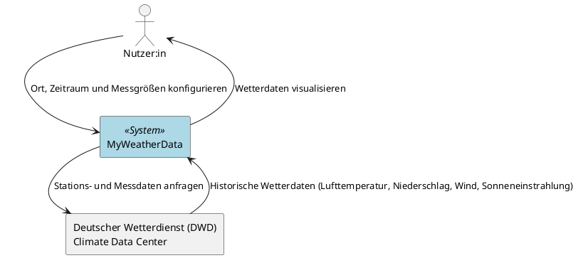
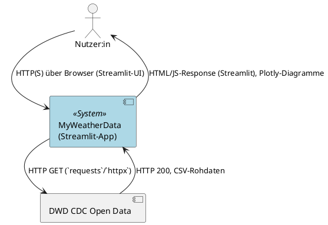

# Kontextsicht – MyWeatherData

Diese Sicht grenzt das System **MyWeatherData** von seiner Umwelt ab (arc42-Kapitel 3, Kontextabgrenzung). Sie zeigt, welche Akteure und Nachbarsysteme mit dem System kommunizieren und welche fachlichen bzw. technischen Informationen dabei ausgetauscht werden.

## Systemgrenze

**MyWeatherData** ist eine lokale Wetter-App zur Visualisierung historischer DWD-Wetterdaten (Lufttemperatur, Niederschlag, Wind, Sonneneinstrahlung) für einen Zeitraum innerhalb 01.01.2015–31.12.2025.

Kommunikationspartner:

| Partner | Art | Rolle |
|---|---|---|
| Nutzer:in | Akteur | Konfiguriert Ort/Zeitraum/Messgrößen, betrachtet Visualisierungen |
| Deutscher Wetterdienst (DWD) Climate Data Center | Nachbarsystem | Liefert Stations- und historische Messdaten (Open Data) |

Die lokale Datenhaltung (SQLite, EPIC-002) sowie der Import-Baustein (EPIC-001) sind **Teil des Systems** und erscheinen daher nicht als eigenständige Nachbarsysteme in dieser Blackbox-Sicht – ihre interne Struktur wird in der [Komponentensicht](./komponentensicht.md) gezeigt.

## Fachlicher Kontext

| # | Von | Nach | Ausgetauschte fachliche Information | Trigger |
|---|---|---|---|---|
| 1 | Nutzer:in | System | Ort (Koordinate), Zeitraum, gewünschte Messgrößen | Nutzer:in konfiguriert Abfrage (EPIC-003) |
| 2 | System | Nutzer:in | Visualisierte Wetterdaten (Zeitreihen) | Nach erfolgreicher Konfiguration/Datenladung (EPIC-004) |
| 3 | System | DWD | Anfrage nach Stationsliste bzw. Messdaten für Station/Zeitraum/Messgröße | Import wird ausgelöst (EPIC-001) |
| 4 | DWD | System | Historische Wetterdaten (Lufttemperatur, Niederschlag, Wind, Sonneneinstrahlung) | Antwort auf Anfrage (#3) |

## Technischer Kontext

| # | Von | Nach | Technische Realisierung | Bezug zu fachlicher Beziehung |
|---|---|---|---|---|
| 1 | Nutzer:in | System | HTTP(S) über Browser, bedient über Streamlit-UI-Widgets | #1 |
| 2 | System | Nutzer:in | Streamlit-Response (HTML/JS), eingebettete Plotly-Diagramme (`st.plotly_chart`) | #2 |
| 3 | System | DWD | HTTP GET über `requests`/`httpx` gegen DWD-CDC-Open-Data-Endpunkte | #3 |
| 4 | DWD | System | HTTP 200 mit CSV-Rohdaten im Response-Body | #4 |

## Konsistenzhinweise

- Systemgrenze ist in beiden Diagrammen identisch: Nutzer:in und DWD CDC Open Data als einzige Kommunikationspartner.
- Die lokale SQLite-Datenbank ist keine Systemgrenze nach außen und wird hier bewusst nicht dargestellt (siehe [Komponentensicht](./komponentensicht.md)).

## Selbstcheck (Schnell-Checkliste)

- [x] Systemgrenze ist in fachlichem und technischem Diagramm identisch
- [x] Alle Akteure und Nachbarsysteme aus Epics/User Stories/FRs sind berücksichtigt (Nutzer:in, DWD; EPIC-002-Datenhaltung ist interne Komponente)
- [x] Fachlicher Kontext enthält keine Technologienamen/Protokolle
- [x] Technischer Kontext benennt konkrete Protokolle/Formate passend zum Techstack (HTTP(S), `requests`/`httpx`, CSV, Streamlit, Plotly)
- [x] Jede Kommunikationsbeziehung hat eine eindeutige Pfeilrichtung und aussagekräftige Beschriftung
- [x] Reines UML ohne C4-Includes, gültige `@startuml`/`@enduml`-Blöcke
- [x] Diagramme liegen unter `arc/statische_sichten/` und sind in `kontextsicht.md` eingebunden
