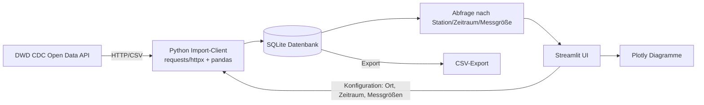

# Tech-Stack Übersicht – MyWeatherData

> Referenzdokument für den im Projekt verwendeten Tech-Stack. Herleitung und Bewertung der Alternativen siehe [Bewertung Tech-Stack](./bewertung-techstack.md).

## Gewählter Stack

| Baustein | Technologie |
|---|---|
| Programmiersprache | Python |
| DWD-Datenimport | Eigener HTTP-Client + Parser (`requests`/`httpx` + `pandas`) |
| Lokale Datenbank | SQLite (Zugriff über `sqlite3` bzw. SQLAlchemy) |
| UI / Konfigurationsoberfläche | Streamlit |
| Visualisierung | Plotly (insb. `plotly.express`) |

## Architekturüberblick

## Zuordnung zu den Epics

| Epic | Verwendete Technologie(n) |
|---|---|
| [EPIC-001: Datenimport/-export DWD](../../req/epic/EPIC-001-datenimport-export-dwd.md) | Python, `requests`/`httpx`, `pandas` (Import & CSV-Export) |
| [EPIC-002: Lokale Datenhaltung](../../req/epic/EPIC-002-lokale-datenhaltung.md) | SQLite, `sqlite3`/SQLAlchemy |
| [EPIC-003: UI-Konfiguration](../../req/epic/EPIC-003-ui-konfiguration.md) | Streamlit |
| [EPIC-004: Visualisierung](../../req/epic/EPIC-004-visualisierung.md) | Plotly (eingebettet in Streamlit) |

## Komponenten im Detail

### Programmiersprache: Python
- Einheitliche Sprache für Import, Datenhaltung, UI und Visualisierung
- Großes Ökosystem für Datenverarbeitung (`pandas`, `numpy`)

### DWD-Datenimport
- HTTP-Zugriff auf den DWD-CDC-Open-Data-Bereich mit `requests` oder `httpx`
- Parsen der Rohdatenformate gemäß den Beschreibungen in [doc/DWD/md](../DWD/md)
- Aufbereitung der Rohdaten mit `pandas`, bevor sie in die Datenbank übernommen werden
- Export aufbereiteter Daten als CSV (z. B. via `pandas.DataFrame.to_csv`)

### Lokale Datenbank: SQLite
- Speicherung als einzelne Datei, keine separate Serverinstallation nötig
- Zugriff über die Standardbibliothek `sqlite3` oder objektrelational über SQLAlchemy
- Datenmodell für Stationen und Messwerte (Lufttemperatur, Niederschlag, Wind, Sonneneinstrahlung)
- Eindeutigkeits-/Unique-Constraints zur Duplikatvermeidung bei wiederholtem Import (US-008)

### UI: Streamlit
- Rein in Python implementierte Web-Oberfläche, kein separates Frontend-Framework nötig
- Widgets für Koordinatenauswahl, Zeitraumauswahl und Auswahl der Messgrößen (EPIC-003)
- Auslösen von Import/Abfrage direkt aus der UI heraus

### Visualisierung: Plotly
- Interaktive Zeitreihendiagramme (Zoom, Hover) für alle vier Messgrößen
- Gemeinsame Darstellung mehrerer Messgrößen (US-018) durch kombinierte Plotly-Figuren
- Direkte Einbettung in Streamlit über `st.plotly_chart`

## Wichtige Bibliotheken (Zusammenfassung)

| Zweck | Bibliothek |
|---|---|
| HTTP-Requests | `requests` oder `httpx` |
| Datenverarbeitung | `pandas` |
| Datenbankzugriff | `sqlite3` (Standardbibliothek) oder `SQLAlchemy` |
| UI | `streamlit` |
| Visualisierung | `plotly` |
